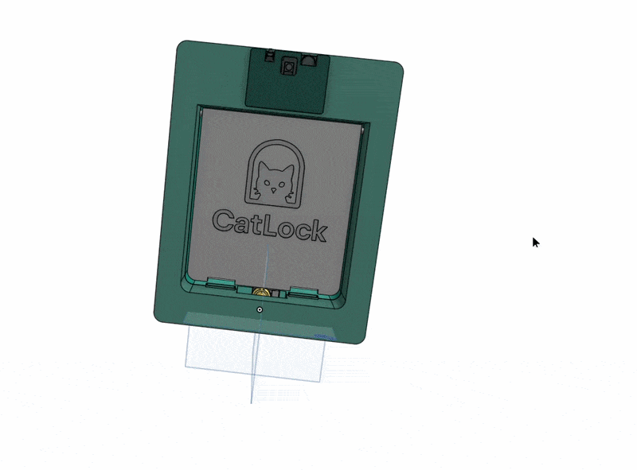
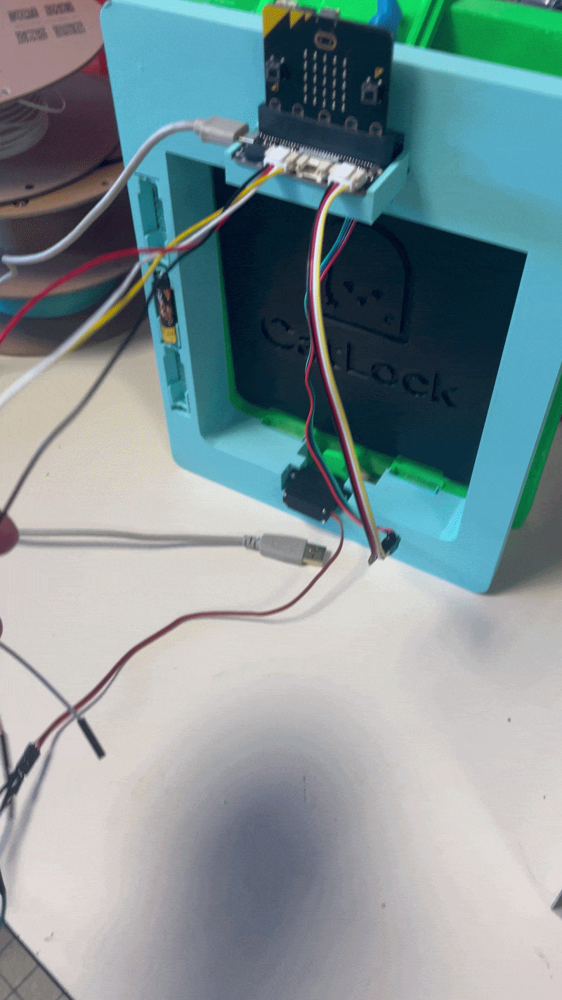
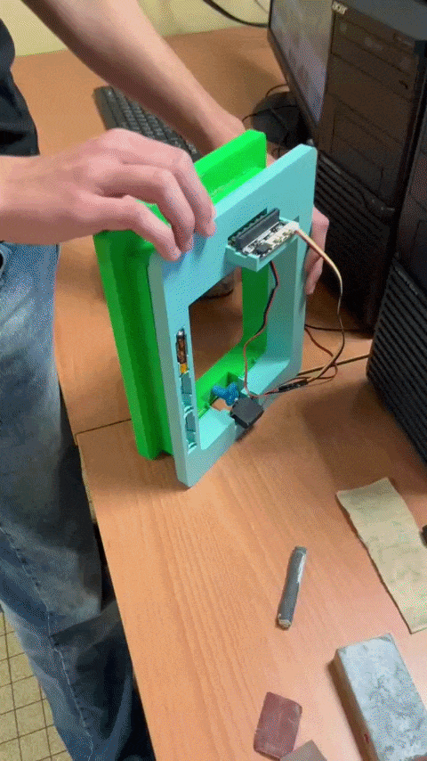

# Chatière connectée 

## 🎯 Objectif
Et si la chatière de votre chat fonctionnait comme une vraie porte ?

Votre chat peut entrer et sortir librement. Mais il n’est pas le seul à pouvoir essayer de passer.

Renards, fouines, ratons laveurs, hérissons… Des animaux sauvages peuvent s’approcher des habitations et, lorsqu’une chatière est accessible, profiter de cette ouverture pour entrer à leur tour.

Le problème, c’est qu’une chatière classique ne vérifie pas qui entre.

Notre solution ajoute une couche d’intelligence à la chatière : une caméra analyse l’animal devant l’ouverture et l’IA détermine s’il s’agit bien du chat autorisé.

## 🛠️ Technologies utilisées
- Python ou JavaScript 
- Conception 3D sur OnShape (.x_t)
- Diagramme fonctionnel / structurel
- Système embarqué (carte Microbit + HuskyLens)

## ⚙️ Fonctionnement
Le système repose sur :
- une partie logicielle en Python ou JavaScript
- une conception mécanique de la chatière
- un diagramme décrivant l’architecture globale
- une carte Microbit, un servomoteur, une carte HuskyLens

## 🔗 Fonctionnalités
Le système permet également grâce à des boutons de :
- activer un mode "confinement", c'est à dire de bloquer le loquet permettant l'entrée jusqu'à nouvel ordre
- savoir si la chatière est actuellement en mode confinement ou non (affichage sur LEDs de la MicroBit)
- débloquer sur commande le loquet de la chatière

## 🧩 Partie 3D
Le fichier a une extension .x_t et a été conçu sur OnShape.

La chatière a déjà été imprimée en 3D et son impression a été réussie.

La chatière est composée de deux blocs, un bloc avant et un bloc arrière, qui s’assemblent de part et d’autre de la porte après réalisation d’une ouverture adaptée.

Elle intègre un battant mobile personnalisé avec le logo de la chatière, ainsi qu’un loquet de verrouillage actionné par un servomoteur, permettant de bloquer le battant lorsque l’accès n’est pas autorisé.

Des logements pour aimants sont intégrés dans la partie inférieure du battant et dans le cadre de la chatière afin d’assurer un meilleur maintien du battant en position fermée et d’améliorer sa résistance au vent.

Un emplacement dédié à la carte micro ainsi qu’un logement pour la caméra intelligente HuskyLens sont directement intégrés à la structure. Un capot de protection recouvre la caméra tout en laissant son champ de vision dégagé, afin de limiter son exposition à la pluie, au vent et aux autres éléments extérieurs.

La structure comprend également un logement pour le servomoteur, directement relié au mécanisme du loquet, ainsi qu’un compartiment intégré permettant d’accueillir trois piles destinées à alimenter l’électronique embarquée.

Des passages de câbles sont également prévus dans la structure afin de faciliter la connexion entre les différents composants électroniques et électromécaniques.

## 📂 Organisation du projet
- `software/` : programme Python/JavaScript
- `specifications/` : diagrammes et schémas
- `3d/` : modèle 3D de la chatière

## 🚀 Améliorations possibles
- Application mobile
- Savoir si le chat est actuellement dehors ou non. (nécessite l'ajout d'un capteur supplémentaire pour voir les mouvements du battant de la chatière)
